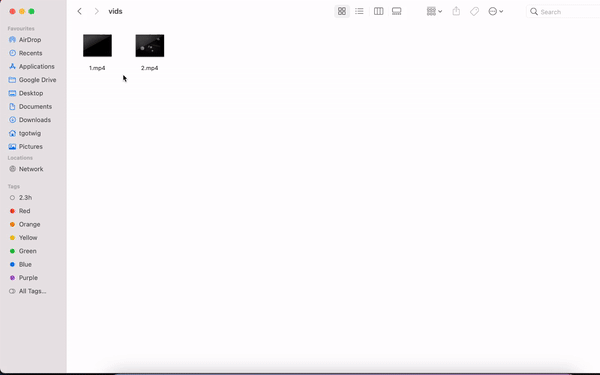

<p align="center"><a></a></p>

<h1 align="center">Vidmerger</h1>
<p align="center">A wrapper around ffmpeg which simplifies merging of multiple videos.</p>
<br>
<p align="center"></p>

## 🙉 What is this exactly?

Vidmerger is a command-line-tool which uses **ffmpeg** to merge multiple video-files with the same file-extension together into one file called _output.FORMAT_. It also includes a usage help 🤗

```shell
USAGE:
    vidmerger [OPTIONS] <DIR>

ARGS:
    <DIR>    Sets the directory to use

FLAGS:
    -h, --help       Prints help information
    -p, --preview    Prints previews of the merge-orders without merging them
    -V, --version    Prints version information

OPTIONS:
    -f, --format <format>   Specifies which formats should be merged individually,
                            the default is 👉 avchd,avi,flv,mkv,mov,mp4,webm,wmv
```

## ✨ Installing / Getting started

You can install it on all the three major operating systems 🤗

[Homebrew 🍺](https://github.com/TGotwig/homebrew-vidmerger/blob/master/vidmerger.rb) on MacOS 🍏

```bash
brew install ffmpeg # prerequisite
brew tap tgotwig/vidmerger
brew install vidmerger
```

---

[Homebrew 🍺](https://github.com/TGotwig/homebrew-linux-vidmerger/blob/master/vidmerger.rb) on Linux 🐧

```bash
sudo snap install ffmpeg --edge # prerequisite
brew tap tgotwig/linux-vidmerger
brew install vidmerger
```

---

[Chocolatey 🍫](https://chocolatey.org/packages/vidmerger) on Windows 🏳️‍🌈

```powershell
choco install ffmpeg # prerequisite
choco install vidmerger
```

---

### ⭐️ Using Vidmerger ⭐️

First of all lets see what we have:

```fish
↪ exa -lh | awk '{print $2,$7}'
Size
328k 1.mp4
328k 2.mp4
```

now just run the following line:

```fish
↪ vidmerger .

Order of merging 👇

file '1.mp4'
file '2.mp4'

Calling: 'ffmpeg -y -f concat -i data/list.txt -c copy data/output.mp4' 🚀

...

Successfully generated 'output.mp4'! 😆🎞
```

per default it goes through the filename extensions **avchd,avi,flv,mkv,mov,mp4,webm,wmv** and tries to merge all mp4 files to out.mp4, all webm files to out.webm, and so on 😊 When everything went smooth, it should look like this:

```fish
↪ exa -lh | awk '{print $2,$7}'
Size
328k 1.mp4
328k 2.mp4
664k output.mp4
```

There it is! 🎉🎊🥳📺🍿

## 🐳 Run it without installing

You can also use Docker to run vidmerger without installing anything except Docker, hosted on [Dockerhub](https://hub.docker.com/r/tgotwig/vidmerger).


```bash
docker container run -v <ABSOLUTE-PATH-TO-YOUR-VIDEOS>:/data tgotwig/vidmerger
```

Example with Bash:

```bash
docker container run -v `pwd`/data:/data tgotwig/vidmerger
```

## ⚙️ Developing

### Built With

Rust and some listed Crates inside of [Cargo.toml](Cargo.toml) under _dependencies_.

### Prerequisites

- [Rust 2018+](https://www.rust-lang.org/tools/install)
- [youtube-dl](http://ytdl-org.github.io/youtube-dl/download.html) (for tests 🧪)
- [ffmpeg](https://ffmpeg.org/download.html) (for tests 🧪)
- If you are on Windows and want to have the `make` command: [Windows Subsystem for Linux with Ubuntu](https://www.microsoft.com/de-de/p/ubuntu-2004-lts/9n6svws3rx71?activetab=pivot:overviewtab)

### Setting up Dev

Once you are done with installing the prerequisites, you should run `make` to see if everything runs smooth:

```shell
git clone git@github.com:TGotwig/vidmerger.git
cd vidmerger
make
```

Also click on _fork_ from the top right corner of this repository and run:

```shell
git remote add <your-github-name> git@github.com:<your-github-name>/vidmerger.git
```

[Here](https://youtu.be/j_qpzND5yAg) is a little tutorial about working with forks along with [GitKraken](https://www.gitkraken.com) 🐙

### Building

Run `make build` to build for Mac, Linux and Windows. You can find the compressed Mac & Linux .tar.gz-archives for Github under _target/tars_, the .exe file for Windows under _tools_.

### Deploying / Publishing

The best is to increase all versions by _find and replace_, then after `make build`:

- Homebrew (MacOS): Edit the version and the hash [there](https://github.com/TGotwig/homebrew-vidmerger/blob/master/vidmerger.rb).
- Homebrew (Linux): Edit the version and the hash [there](https://github.com/TGotwig/homebrew-linux-vidmerger/blob/master/vidmerger.rb).
- Chocolatey (Windows): Edit the hash inside of _tools/VERIFICATION.txt_ and run `make publish-choco`.
- Dockerhub: Run `make publish-dockerhub`.

## 📦 Versioning

We use [SemVer](http://semver.org/) for versioning.

## 🧪 Tests

There are some shell- and cargo-tests, which can be run by `make test`, requires youtube-dl and ffmpeg installed.

## 🌟 Style guide

We are using [rust-clippy](rust-clippy) and [rls-vscode](https://github.com/rust-lang/rls-vscode).

## 📜 Licensing

[MIT License with “Commons Clause”](LICENSE).
