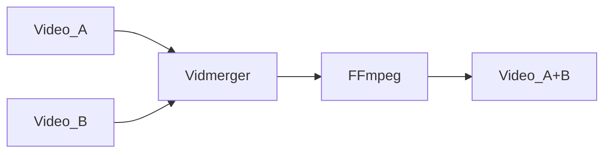

<!-- https://github.com/elsewhencode/project-guidelines/blob/master/README.sample.md -->

<p align="center"><a></a></p>

<h1 align="center">Vidmerger</h1>
<p align="center">A wrapper around FFmpeg which simplifies merging of multiple videos.</p>



<p align="center"></p>

## 🙉 What is this exactly?

Vidmerger is a command-line-tool which uses **ffmpeg** to merge multiple video-files with the same file-extension into one file, for example running `vidmerger .` on mp4 files would create a merged video called `output.mp4` 🐣

Here is the usage help of vidmerger 🤗

```shell
USAGE:
    vidmerger [FLAGS] [OPTIONS] <DIR>

ARGS:
    <DIR>    Sets the input file to use

FLAGS:
    -h, --help        Prints help information
    -p, --preview     Prints previews of the merge-orders without merging them
        --shutdown    For doing a shutdown at the end (needs sudo)
    -V, --version     Prints version information

OPTIONS:
    -f, --format <format>    Specifies which formats should be merged individually, the default is
                             👉 avchd,avi,flv,mkv,mov,mp4,webm,wmv
    -s, --scale <scale>      Scales all videos up before merging, a valid value would be "320:240"
```

## ✨ Installing / Getting started

You can install it on all the three major operating systems 🤗

| Platform       | Packager                                                                                    | Command                                                        |
|:-------------- |:------------------------------------------------------------------------------------------- |:-------------------------------------------------------------- |
| 🍎 MacOS       | 🍺 [Homwbrew](https://github.com/TGotwig/homebrew-vidmerger/blob/master/vidmerger.rb)       | brew tap tgotwig/vidmerger<br>brew install vidmerger           |
| 🐧 Linux       | 🍺 [Homwbrew](https://github.com/TGotwig/homebrew-linux-vidmerger/blob/master/vidmerger.rb) | brew tap tgotwig/linux-vidmerger<br>brew install vidmerger     |
| 🏳️‍🌈 Windows | 🍫 [Chocolatey](https://community.chocolatey.org/packages/vidmerger)                        | choco install ffmpeg # prerequisite<br>choco install vidmerger |

Alternatively you can install it over Wget on Linux:

```bash
sudo wget -c https://github.com/TGotwig/vidmerger/releases/latest/download/vidmerger-linux.tar.gz -O - | sudo tar -xz -C /usr/local/bin
```

## 🐳 Run it without installing

You can also use Docker to run vidmerger without installing anything except Docker, hosted on [Dockerhub](https://hub.docker.com/r/tgotwig/vidmerger).

```bash
docker container run -v <ABSOLUTE-PATH-TO-YOUR-VIDEOS>:/data tgotwig/vidmerger
```

Example with Bash:

```bash
docker container run -v `pwd`/data:/data tgotwig/vidmerger
```

## ⚙️ Developing

### Built With

Rust and some listed Crates inside of [Cargo.toml](Cargo.toml) under _dependencies_.

### Prerequisites

- [Rust 2021](https://www.rust-lang.org/tools/install)
- [yt-dlp](https://github.com/yt-dlp/yt-dlp) or [youtube-dl](http://ytdl-org.github.io/youtube-dl/download.html)
- [ffmpeg](https://ffmpeg.org/download.html)
- If you are on Windows and want to have the `make` command: [Windows Subsystem for Linux with Ubuntu](https://www.microsoft.com/de-de/p/ubuntu-2004-lts/9n6svws3rx71?activetab=pivot:overviewtab)

### Setting up Dev

Once you are done with installing the prerequisites, you should run `make` to see if everything runs smooth:

```shell
git clone git@github.com:TGotwig/vidmerger.git
cd vidmerger
make
```

Also click on _fork_ from the top right corner of this repository and run:

```shell
git remote add <your-github-name> git@github.com:<your-github-name>/vidmerger.git
```

[Here](https://youtu.be/j_qpzND5yAg) is a little tutorial about working with forks along with [GitKraken](https://www.gitkraken.com) 🐙

### Building

Run `make build` to build for Mac, Linux and Windows. You can find the compressed Mac & Linux .tar.gz-archives for Github under _target/tars_, the .exe file for Windows under _tools_.

### Deploying / Publishing

#### Automated steps

- Homebrew (MacOS & Linux): Gets automatically deployed by [release.yml](https://github.com/TGotwig/vidmerger/blob/master/.github/workflows/release.yml) after pushing a git tag.

#### Manual steps

Increasing all versions by _find and replace_, then after `make build`:

- Chocolatey (Windows): Edit the hash inside of _tools/VERIFICATION.txt_ and run `make publish-choco`.
- Dockerhub: Run `make publish-dockerhub`.

## 📦 Versioning

We use [SemVer](http://semver.org/) for versioning.

## 🧪 Tests

- For major tests: `make test` (requires `yt-dlp` / `youtube-dl` and `ffmpeg` to be installed)
- For linting tests: `make lint`

## 🌟 Style guide

- [rust-clippy](rust-clippy)
- [rls-vscode](https://github.com/rust-lang/rls-vscode)
- [conventionalcommits](https://www.conventionalcommits.org/en/v1.0.0)

## 📜 Licensing

[MIT License with “Commons Clause”](LICENSE).
