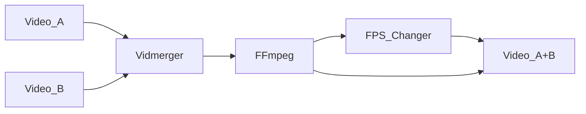

<!-- https://github.com/elsewhencode/project-guidelines/blob/master/README.sample.md -->

<p align="center"><a></a></p>

<h1 align="center">Vidmerger</h1>
<p align="center">A wrapper around FFmpeg which simplifies merging of multiple videos.</p>



<p align="center"></p>

## 🙉 What is this exactly?

Vidmerger is a command-line-tool which uses **ffmpeg** to merge multiple video-files with the same file-extension into one file, for example running `vidmerger .` on mp4 files would create a merged video called `output.mp4` 🐣

Here is the usage help of vidmerger 🤗

```shell
USAGE:
    vidmerger [OPTIONS] <TARGET_DIR>

ARGS:
    <TARGET_DIR>    Sets the input file to use

OPTIONS:
    -f, --format <format>     Specifies which formats should be merged individually, the default is
                              👉 3g2,3gp,aac,ac3,alac,amr,ape,au,avi,awb,dts,f4a,f4b,f4p,f4v,flac,flv,m4a,m4b,m4p,m4r,m4v,mkv,mov,mp2,mp3,mp4,mpeg,mpg,oga,ogg,ogm,ogv,ogx,opus,pcm,spx,wav,webm,wma,wmv
        --fps <fps>           Generates videos inside a temporary folder with this fps value and
                              merges them
    -h, --help                Print help information
        --shutdown            For doing a shutdown at the end (needs sudo)
        --skip-fps-changer    Skips the fps changer
        --skip-wait           Skips the wait time for reading
    -V, --version             Print version information
```

## ✨ Installing / Getting started

You can install it on all the three major operating systems 🤗

### x86

| Platform  | Packager                                                                                   | Command                                                                                                                                                                   |
| :-------- | :----------------------------------------------------------------------------------------- | :------------------------------------------------------------------------------------------------------------------------------------------------------------------------ |
| 🍎 MacOS   | 🍺 [Homwbrew](https://github.com/TGotwig/homebrew-vidmerger/blob/master/vidmerger.rb)       | brew tap tgotwig/vidmerger<br>brew install vidmerger                                                                                                                      |
| 🐧 Linux   | 🍺 [Homwbrew](https://github.com/TGotwig/homebrew-linux-vidmerger/blob/master/vidmerger.rb) | brew tap tgotwig/linux-vidmerger<br>brew install vidmerger                                                                                                                |
| 🐧 Linux   | 🍺 WGET                                                                                     | sudo wget -c https://github.com/TGotwig/vidmerger/releases/latest/download/vidmerger-linux.tar.gz -P /tmp && sudo tar -xzvf /tmp/vidmerger-linux.tar.gz -C /usr/local/bin |
| 🏳️‍🌈 Windows | 🍫 [Chocolatey](https://community.chocolatey.org/packages/vidmerger)                        | choco install ffmpeg # prerequisite<br>choco install vidmerger                                                                                                            |

### ARM

| Platform | Packager                                                                             | Command                                                                                                                                                                                 |
| :------- | :----------------------------------------------------------------------------------- | :-------------------------------------------------------------------------------------------------------------------------------------------------------------------------------------- |
| 🍎 MacOS  | 🍺 [Homwbrew](https://github.com/TGotwig/homebrew-vidmerger/blob/master/vidmerger.rb) | brew tap tgotwig/vidmerger<br>brew install vidmerger                                                                                                                                    |
| 🐧 Linux  | 🍺 WGET                                                                               | sudo wget -c https://github.com/bonny1992/vidmerger/releases/latest/download/vidmerger-linux-arm64.tar.gz -P /tmp && sudo tar -xzvf /tmp/vidmerger-linux-arm64.tar.gz -C /usr/local/bin |

## 🐳 Run it without installing

You can also use Docker to run vidmerger without installing anything except Docker, hosted on [Dockerhub](https://hub.docker.com/r/tgotwig/vidmerger).

```bash
docker container run -v <ABSOLUTE-PATH-TO-YOUR-VIDEOS>:/data tgotwig/vidmerger
```

Example with Bash:

```bash
docker container run -v `pwd`/data:/data tgotwig/vidmerger
```

## ⚙️ Developing

### Built With

Rust and some listed Crates inside of [Cargo.toml](Cargo.toml) under _dependencies_.

### Prerequisites

- [Rust 2021](https://www.rust-lang.org/tools/install)
- [yt-dlp](https://github.com/yt-dlp/yt-dlp/wiki/Installation)
- [ffmpeg](https://ffmpeg.org/download.html)
- [task](https://taskfile.dev/#/installation)

### Setting up Dev

Once you are done with installing the prerequisites, you should run `task` to see if everything runs smooth:

```shell
git clone git@github.com:TGotwig/vidmerger.git
cd vidmerger
task
```

Also click on _fork_ from the top right corner of this repository and run:

```shell
git remote add <your-github-name> git@github.com:<your-github-name>/vidmerger.git
```

[Here](https://youtu.be/j_qpzND5yAg) is a little tutorial about working with forks along with [GitKraken](https://www.gitkraken.com) 🐙

### Building

Run `task build` to build for Mac, Linux and Windows. You can find the compressed Mac & Linux .tar.gz-archives for Github under _target/tars_, the .exe file for Windows under _tools_.

### Deploying / Publishing

#### Automated steps

- Homebrew (MacOS & Linux): Gets automatically deployed by [release.yml](https://github.com/TGotwig/vidmerger/blob/master/.github/workflows/release.yml) after pushing a git tag.
- Chocolatey (Windows): Gets automatically deployed by [release.yml](https://github.com/TGotwig/vidmerger/blob/master/.github/workflows/release.yml) after pushing a git tag.

#### Manual steps

Increasing all versions by _find and replace_, then after `task build`:

- Dockerhub: Run `task publish_dockerhub`.

## 📦 Versioning

We use [SemVer](http://semver.org/) for versioning.

## 🧪 Tests

- For major tests: `task test` (requires `yt-dlp` and `ffmpeg` to be installed)
- For linting tests: `task lint`

## 🌟 Style guide

- [rust-clippy](rust-clippy)
- [rls-vscode](https://github.com/rust-lang/rls-vscode)
- [conventionalcommits](https://www.conventionalcommits.org/en/v1.0.0)

## 📜 Licensing

[MIT License with “Commons Clause”](LICENSE).
