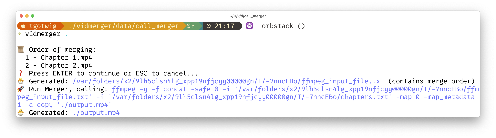
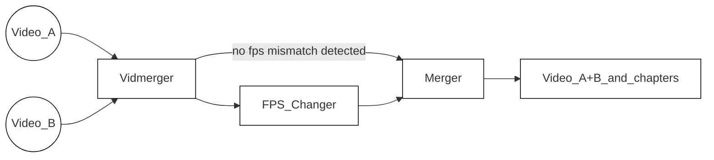

<!-- https://github.com/elsewhencode/project-guidelines/blob/master/README.sample.md -->

<p align="center"><a></a></p>

<h1 align="center">Vidmerger</h1>
<p align="center">A wrapper around FFmpeg which simplifies merging of multiple videos.</p>



## 🙉 What is this exactly?

Vidmerger is a command-line-tool which uses **ffmpeg** to merge multiple video-files with the same file-extension into one file, for example running `vidmerger .` on mp4 files would create a merged video called `output.mp4` 🐣

Here is the usage help of vidmerger 🤗

```shell
A wrapper around ffmpeg which simplifies merging multiple videos 🎞  Everything in between the first `-` till the fill extension of the input files will be used as chapter titles 📖.

Usage: vidmerger [OPTIONS] <TARGET_DIR>

Arguments:
  <TARGET_DIR>  Sets the input file to use

Options:
  -f, --format <format>   Specifies which formats should be merged individually, the default is 👉 3g2,3gp,aac,ac3,alac,amr,ape,au,avi,awb,dts,f4a,f4b,f4p,f4v,flac,flv,m4a,m4b,m4p,m4r,m4v,mkv,mov,mp2,mp3,mp4,mpeg,mpg,oga,ogg,ogm,ogv,ogx,opus,pcm,spx,wav,webm,wma,wmv
      --fps <fps>         Generates videos inside a temporary folder with this fps value and merges them
      --shutdown          For doing a shutdown at the end (needs sudo)
      --skip-fps-changer  Skips the fps changer
  -y, --yes               Skips confirmation of merge order
      --verbose           Prints detailed logs
  -h, --help              Print help
  -V, --version           Print version
```




| Feature     | Description                                                                                                                                                                                                                                     |
| :---------- | ----------------------------------------------------------------------------------------------------------------------------------------------------------------------------------------------------------------------------------------------- |
| Selector    | Iterates through [this list of file endings](src/main.rs#L34), selects all files which matches with the current file ending except ones which start with a dot. The list can be overwritten by `--format` or `-f`, example: `--format mp4,mkv`. |
| FPS_Changer | After detecting not matching fps values, it scales all the higher fps videos down to the lowest detecting fps value. Can be skipped by `--skip-fps-changer`. The desired fps value can be set by `--fps`, example: `--fps 23.976`.              |
| Merger      | Finally, it merges the videos and adds chapters. Chapter titles are automatically extracted from the input file names — specifically, the text between the first dash and the file extension. Example: `Video_A - Chapter 1.mp4`. |

## ✨ Installing / Getting started

You can install it on all the three major operating systems 🤗

### X64

| Platform  | Packager                                                                                   | Command                                                                                                                                                                                          |
| :-------- | :----------------------------------------------------------------------------------------- | :----------------------------------------------------------------------------------------------------------------------------------------------------------------------------------------------- |
| 🍎 MacOS   | 🍺 [Homwbrew](https://github.com/TGotwig/homebrew-vidmerger/blob/master/vidmerger.rb)       | brew tap tgotwig/vidmerger<br>brew install vidmerger                                                                                                                                             |
| 🐧 Linux   | 🍺 [Homwbrew](https://github.com/TGotwig/homebrew-linux-vidmerger/blob/master/vidmerger.rb) | brew tap tgotwig/linux-vidmerger<br>brew install vidmerger                                                                                                                                       |
| 🐧 Linux   | 🍺 CURL                                                                                     | sudo curl -L https://github.com/TGotwig/vidmerger/releases/latest/download/vidmerger-linux.tar.gz -o /tmp/vidmerger-linux.tar.gz && sudo tar -xzvf /tmp/vidmerger-linux.tar.gz -C /usr/local/bin |
| 🏳️‍🌈 Windows | 🍫 [Chocolatey](https://community.chocolatey.org/packages/vidmerger)                        | choco install ffmpeg # prerequisite<br>choco install vidmerger                                                                                                                                   |

### ARM64

| Platform | Packager                                                                             | Command                                                                                                                                                                                                           |
| :------- | :----------------------------------------------------------------------------------- | :---------------------------------------------------------------------------------------------------------------------------------------------------------------------------------------------------------------- |
| 🍎 MacOS  | 🍺 [Homwbrew](https://github.com/TGotwig/homebrew-vidmerger/blob/master/vidmerger.rb) | brew tap tgotwig/vidmerger<br>brew install vidmerger                                                                                                                                                              |
| 🐧 Linux  | 🍺 CURL                                                                               | sudo curl -L https://github.com/tgotwig/vidmerger/releases/download/0.4.0/vidmerger-linux-arm64.tar.gz -o /tmp/vidmerger-linux-arm64.tar.gz && sudo tar -xzvf /tmp/vidmerger-linux-arm64.tar.gz -C /usr/local/bin |

## 🐳 Run it without installing

You can also use Docker to run vidmerger without installing anything except Docker, hosted on [Dockerhub](https://hub.docker.com/r/tgotwig/vidmerger).

```bash
docker container run -it -v <PATH-TO-YOUR-VIDEOS>:/data tgotwig/vidmerger
```

Examples with Bash:

```bash
docker container run tgotwig/vidmerger --help
docker container run tgotwig/vidmerger --version
docker container run -it -v ./data/call_merger:/data tgotwig/vidmerger
```

## ⚙️ Developing

### Built With

Rust and some listed Crates inside of [Cargo.toml](Cargo.toml) under _dependencies_.

### Prerequisites

- [Rust 2021](https://www.rust-lang.org/tools/install)
- [ffmpeg](https://ffmpeg.org/download.html)
- [task](https://taskfile.dev/#/installation)

### Setting up Dev

Once you are done with installing the prerequisites, run `task`:

```shell
git clone git@github.com:TGotwig/vidmerger.git
cd vidmerger
task
```

If you see anything to improve, just create an [issue](https://github.com/tgotwig/vidmerger/issues) or directly open a [pull request](https://github.com/tgotwig/vidmerger/pulls) 🤗✨

### Building

Run `task build` to build for Mac, Linux and Windows. You can find the compressed Mac & Linux .tar.gz-archives for Github under _target/tars_, the .exe file for Windows under _tools_.

### Deploying / Publishing

For details on how to publish a new version, you can look up the [Publish new version](https://github.com/tgotwig/vidmerger/wiki#-publish-new-version) wiki page.

## 📦 Versioning

We use [SemVer](http://semver.org/) for versioning.

## 🧪 Tests

- For major tests: `task test` (requires `ffmpeg` to be installed)
- For linting tests: `task lint`

## 🌟 Style guide

- [rust-clippy](rust-clippy)
- [rls-vscode](https://github.com/rust-lang/rls-vscode)
